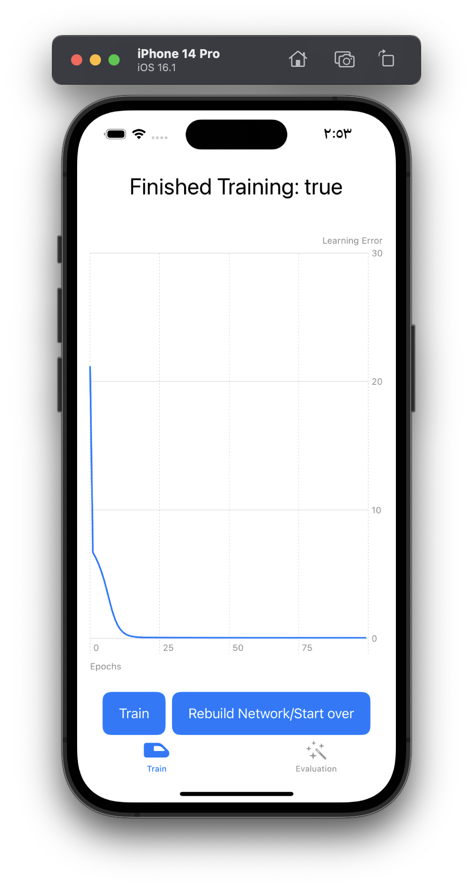
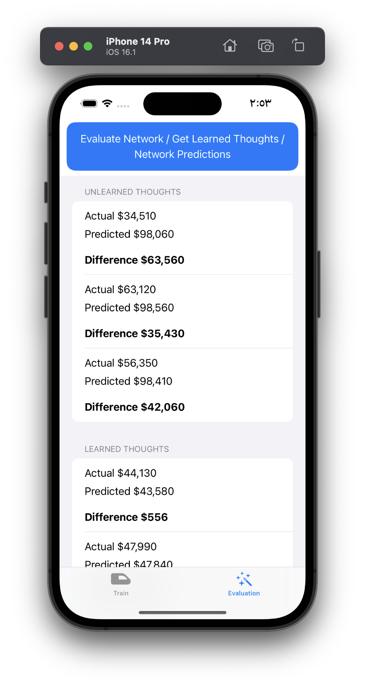

# Neurons

A simple neural network written in pure Swift. Based on [this](https://www.cephalopod.studio/blog/a-casual-yet-thorough-amp-hands-on-explanation-of-neural-networks-with-swift-swiftui-and-charts) tutorial.

